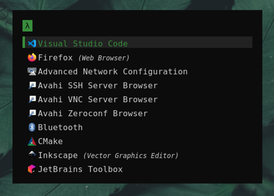
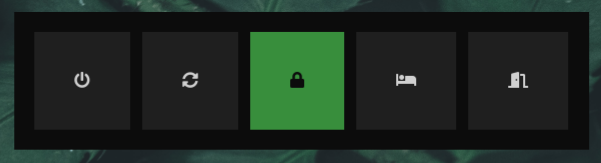

# Installation

Start by following [pre.sh](pre.sh) (I haven't tried to automate those steps yet) and then do the following

```
curl -O https://raw.githubusercontent.com/christianmesch/arch/master/install.sh
chmod +x install.sh
./install.sh
```

# Screenshots







---

Influenced by [MunHunger](https://github.com/munHunger/arch_install).